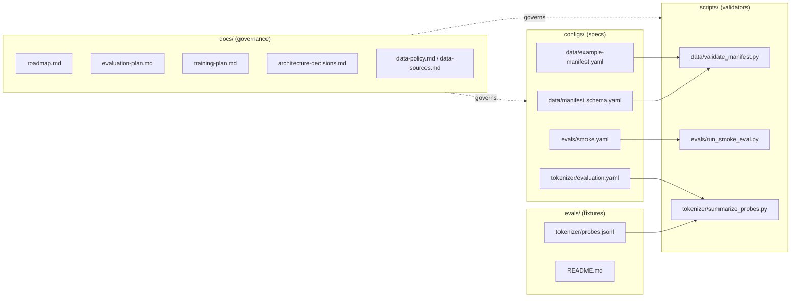
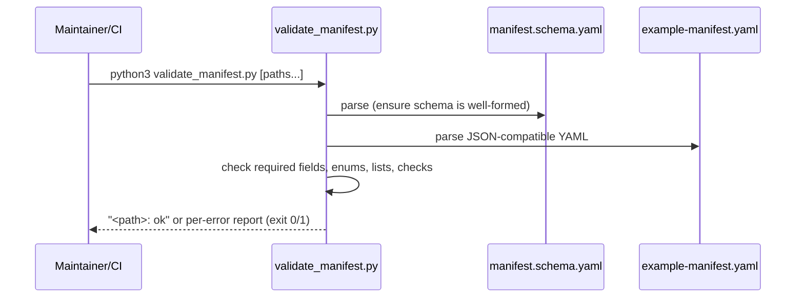

# System Architecture

## System Overview

fal'Cie is currently an **early-stage research repository**, not a running application. There is no service, API server, model code, or deployed infrastructure yet. The repository is organized around four documentation/specification/tooling concerns that together form the foundation of an open-weight LLM pipeline:

1. **Governance docs** (`docs/`) — what to build, why, and the gates for release.
2. **Reproducible configs** (`configs/`) — machine-readable specs (data manifest schema, eval smoke config, tokenizer evaluation criteria).
3. **Dependency-free scripts** (`scripts/`) — validators/summarizers that enforce the configs.
4. **Evaluation fixtures** (`evals/`) — probe data and benchmark inventory.

The architecture is deliberately minimal and "smoke-test first": every script uses only the Python standard library so the pipeline can run end-to-end before any dependency-managed environment or training framework is adopted (per Training Plan Stage 0).

## Architecture Diagram

### Text Alternative
- `configs/data/manifest.schema.yaml` and `configs/data/example-manifest.yaml` are consumed by `scripts/data/validate_manifest.py`.
- `configs/evals/smoke.yaml` is consumed by `scripts/evals/run_smoke_eval.py` (emits a JSON report).
- `evals/tokenizer/probes.jsonl` is consumed by `scripts/tokenizer/summarize_probes.py`; `configs/tokenizer/evaluation.yaml` defines the criteria.
- `docs/` governs all configs and scripts (principles, gates, decisions).

## Component Descriptions

### docs/
- **Purpose**: Public planning and governance.
- **Responsibilities**: Roadmap/milestones, evaluation and release gates, training stages, architecture decision records, data policy and sources, model-card template.
- **Dependencies**: None (markdown).
- **Type**: Documentation.

### configs/
- **Purpose**: Reproducible, machine-readable specifications.
- **Responsibilities**: Data manifest schema + example, evaluation smoke config, tokenizer evaluation criteria.
- **Dependencies**: Consumed by `scripts/`.
- **Type**: Configuration.

### scripts/
- **Purpose**: Enforce the specs with dependency-free validators/summarizers.
- **Responsibilities**: Validate manifests, validate eval configs and emit reports, validate/summarize tokenizer probes.
- **Dependencies**: Python 3 standard library; reads files under `configs/` and `evals/`; `run_smoke_eval.py` shells out to `git` for commit SHA (optional).
- **Type**: Application (CLI tooling).

### evals/
- **Purpose**: Evaluation fixtures and inventory.
- **Responsibilities**: Tokenizer probe fixtures (`probes.jsonl`), benchmark inventory (`README.md`).
- **Dependencies**: Consumed by `scripts/tokenizer/summarize_probes.py`.
- **Type**: Test/Fixture data.

## Data Flow

### Text Alternative
- A maintainer (or CI) runs `validate_manifest.py`.
- The script parses the schema (to confirm it is parseable), then each target manifest.
- It checks required fields, enum values, string-list constraints, and the PII/contamination check objects.
- It prints `ok` per valid file, or a list of errors, and exits non-zero if any file is invalid. The same pattern applies to `run_smoke_eval.py` (eval config → JSON report) and `summarize_probes.py` (probes → coverage summary).

## Integration Points
- **External APIs**: None.
- **Databases**: None.
- **Third-party Services**: None in code. `run_smoke_eval.py` optionally invokes the local `git` binary to capture the commit SHA; falls back to `"unknown"` if unavailable.
- **Planned (per docs)**: Hugging Face and GitHub Releases as future distribution hubs; training framework (PyTorch/HF-compatible path proposed) for future model code.

## Infrastructure Components
- **CDK Stacks**: None.
- **Deployment Model**: None yet (no deployable artifact). Scripts run locally / in CI via `python3`.
- **Networking**: None.
