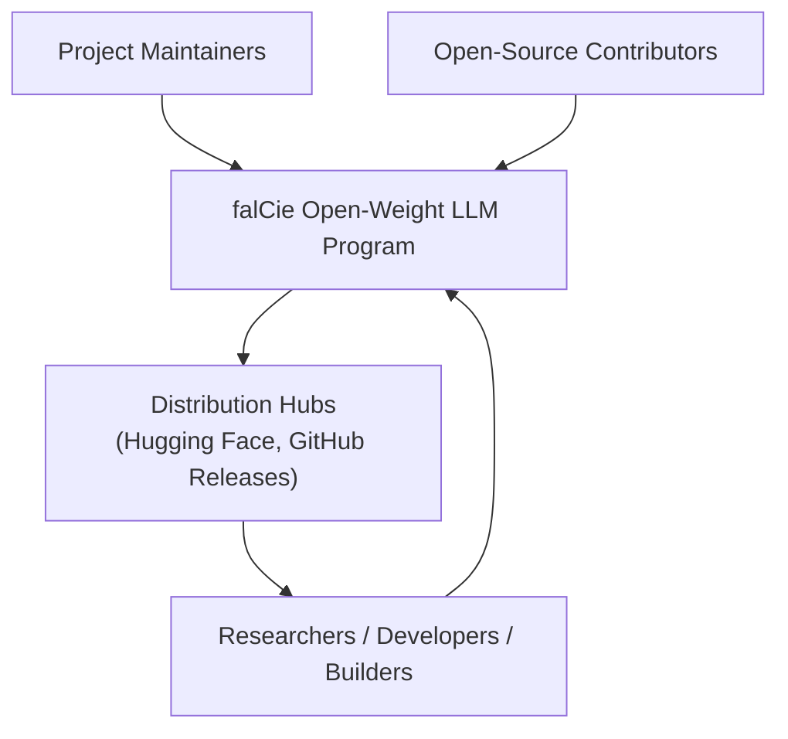

# Business Overview

## Business Context Diagram

### Text Alternative
- Project Maintainers and Open-Source Contributors build the fal'Cie program.
- fal'Cie publishes open weights and artifacts to distribution hubs (Hugging Face, GitHub Releases).
- Researchers / developers / builders consume the weights freely and feed evaluation/feedback back into the program.

## Business Description

- **Business Description**: fal'Cie is an open-weight large language model program. Its mission is to build and release a fully open-weight LLM — trained from the ground up — that is competitive with the strongest closed frontier systems, while preserving reproducibility, multilingual capability (Japanese and English as first-class targets, plus code and math), and permissive downstream use under Apache 2.0. The product is the released model weights plus the reproducible pipeline (data manifests, tokenizer, training configs, evaluation harness) and supporting documentation (model cards, release notes).

- **Business Transactions** (the recurring value-producing activities the system supports):
  - **Curate a dataset**: register a data source as a manifest, record license/PII/contamination posture, and validate the manifest against the schema.
  - **Evaluate a tokenizer candidate**: run multilingual probe fixtures and summarize coverage so candidates can be compared on a stable fixture.
  - **Run an evaluation smoke check**: validate an evaluation config's shape and emit a machine-readable report (no model inference yet).
  - **Plan and govern the program**: maintain roadmap, training plan, evaluation plan, architecture decisions, data policy, and release gates as public, versioned docs.
  - **Release a checkpoint** (future): train a model, produce evaluation evidence + model card, satisfy the release checklist, and publish open weights.

- **Business Dictionary**:
  - **Open-weight**: model parameters are freely downloadable, runnable, fine-tunable, and redistributable (here under Apache 2.0).
  - **Manifest**: a machine-readable record describing one dataset source (license, use, languages, domains, filters, PII/contamination posture, status).
  - **Probe**: a fixed text fixture (id/language/domain/text) used to compare tokenizer candidates on a stable input.
  - **Smoke check**: a lightweight, dependency-free validation that proves a config/pipeline is well-formed before expensive work runs.
  - **Release gate**: an explicit, evidence-based condition a checkpoint must satisfy before it can become a public release candidate.
  - **Milestone (M0–M5)**: staged program phases from public research foundation (M0) to frontier-scale program (M5).

## Component Level Business Descriptions

### docs/ — Program Governance
- **Purpose**: Carries the public promise and the rules that make capability claims credible (roadmap, evaluation plan, training plan, data policy, data sources, architecture decisions, model-card template, release checklist).
- **Responsibilities**: Define North Star and capability targets, milestones and exit criteria, release gates, anti-contamination rules, and the "measured claims only" principle.

### configs/ — Reproducible Specifications
- **Purpose**: Machine-readable specs for data manifests, evaluation smoke configs, and tokenizer evaluation criteria.
- **Responsibilities**: Provide the schema and example artifacts that scripts validate against, so data/eval/tokenizer decisions are reproducible and reviewable.

### scripts/ — Pipeline Foundations
- **Purpose**: Dependency-free Python entry points that enforce the specs (manifest validation, eval smoke run, tokenizer probe summarization).
- **Responsibilities**: Guarantee that manifests, eval configs, and tokenizer probes are well-formed before the project adopts heavier infrastructure.

### evals/ — Evaluation Fixtures
- **Purpose**: Benchmark/probe inventory and stable fixtures (tokenizer probes) used to compare candidates.
- **Responsibilities**: Hold the fixtures and the README inventory that the evaluation workstream builds on.
