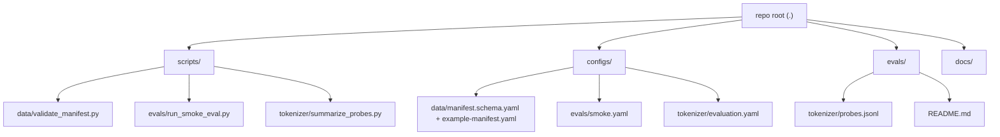

# Code Structure

## Build System
- **Type**: None yet. There is no `package.json`, `pyproject.toml`, `requirements.txt`, `setup.py`, Makefile, or lockfile.
- **Configuration**: Scripts are standalone executables run directly with `python3 scripts/.../<script>.py`. Each script resolves the repo root via `Path(__file__).resolve().parents[2]` and locates configs/fixtures relative to it.
- **Rationale (from code comments)**: Tooling intentionally uses only the Python standard library so the pipeline can run before the project adopts a dependency-managed environment (Training Plan Stage 0: Infrastructure Smoke Tests).

## Module Hierarchy

### Text Alternative
- `scripts/` mirrors `configs/` by concern: `data/`, `evals/`, `tokenizer/`.
- Each script reads its sibling concern's config/fixtures and validates them.

### Existing Files Inventory
(Candidates for modification/extension in this brownfield project.)

- `scripts/data/validate_manifest.py` — Validate dataset manifests (JSON-compatible YAML) against required fields, enums, language tags, list constraints, and PII/contamination check objects.
- `scripts/evals/run_smoke_eval.py` — Validate an evaluation config's shape and emit a JSON smoke report (no model inference); optionally records git commit SHA.
- `scripts/tokenizer/summarize_probes.py` — Validate tokenizer probe JSONL and report character/byte coverage by language and domain.
- `configs/data/manifest.schema.yaml` — Schema describing a dataset manifest.
- `configs/data/example-manifest.yaml` — Example/reference manifest (default validation target).
- `configs/evals/smoke.yaml` — Default evaluation smoke config consumed by `run_smoke_eval.py`.
- `configs/tokenizer/evaluation.yaml` — Tokenizer evaluation criteria/config.
- `evals/tokenizer/probes.jsonl` — Tokenizer probe fixtures (id/language/domain/text per line).
- `evals/README.md` — Evaluation harness / benchmark inventory notes.
- `docs/*.md` — Governance docs (roadmap, evaluation-plan, training-plan, data-policy, data-sources, architecture-decisions, tokenizer-evaluation, model-card-template, release-checklist).
- `docs/index.html`, `docs/ja.html` — Project landing pages (GitHub Pages).
- `AGENTS.md` (symlinked as `CLAUDE.md` is absent here; AGENTS.md present) — agent orchestration instructions.
- `README.md`, `README-ja.md`, `CONTRIBUTING.md`, `LICENSE` — repository meta.

> Note: `scripts/**/__pycache__/*.pyc` are build byproducts (compiled bytecode), not source.

## Design Patterns

### Dependency-free standard-library tooling
- **Location**: all three scripts.
- **Purpose**: run end-to-end before adopting third-party deps; keep CI trivial.
- **Implementation**: `json.loads` is used to parse "JSON-compatible YAML" (manifests/configs authored in JSON syntax with `.yaml` extension), avoiding a YAML dependency.

### Validate-then-report (fail-fast CLI)
- **Location**: `validate_manifest.py`, `run_smoke_eval.py`, `summarize_probes.py`.
- **Purpose**: enforce spec shape before downstream work; produce actionable diagnostics.
- **Implementation**: each script collects a list of error strings, prints them to stderr, and returns a non-zero exit code on failure (`main()` returns int, wrapped in `SystemExit`).

### Root-relative path resolution
- **Location**: all three scripts (`ROOT = Path(__file__).resolve().parents[2]`).
- **Purpose**: scripts work regardless of current working directory.
- **Implementation**: default config/fixture paths derived from `ROOT`.

## Critical Dependencies

### Python standard library
- **Version**: Python 3 (bytecode artifacts indicate CPython 3.14 was used locally; code uses `from __future__ import annotations` and 3.9+ typing such as `dict[str, Any]`).
- **Usage**: `json`, `re`, `sys`, `argparse`, `subprocess`, `datetime`, `collections.Counter`, `pathlib`, `typing`.
- **Purpose**: parsing, validation, reporting, and CLI plumbing without external packages.
