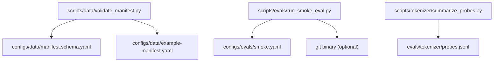

# Dependencies

## Internal Dependencies

### Text Alternative
- `validate_manifest.py` reads `manifest.schema.yaml` (parse check) and `example-manifest.yaml` (default target).
- `run_smoke_eval.py` reads `smoke.yaml` and optionally invokes the `git` binary.
- `summarize_probes.py` reads `probes.jsonl`.
- There are no inter-script imports; each script is self-contained.

### scripts/* depends on configs/* and evals/*
- **Type**: Runtime (file reads).
- **Reason**: scripts validate/summarize the spec and fixture files; they do not import each other.

### run_smoke_eval.py depends on the git CLI
- **Type**: Runtime (optional, external process).
- **Reason**: captures commit SHA for report provenance; falls back to `"unknown"` if `git` is missing or fails.

## External Dependencies
- **None (Python packages)**: no `requirements.txt` / `pyproject.toml` / lockfile. All code uses the Python 3 standard library only:
  - `json`, `re`, `sys`, `argparse`, `subprocess`, `datetime`, `collections`, `pathlib`, `typing`, `__future__`.
- **System dependency (optional)**: `git` (only for commit-SHA provenance in the eval smoke report).
- **License of dependencies**: N/A — Python standard library ships with CPython (PSF License). Project itself is Apache 2.0.

## Notable Absences (relevant for future work)
- No ML/training framework (PyTorch, JAX, Transformers) yet — a deliberate Stage 0 choice.
- No YAML library — configs are constrained to the JSON subset on purpose.
- No test framework, linter, formatter, or type checker wired up.
